# Tabla de contenidos
- [Teoria](#Teoria)
    - [¿Que es Docker?](#Docker)
        - [¿Que es un contenedor?](#Contenedor)
    - [¿Que es Docker Compose?](#Docker-Compose)
    - [Utilización](#Utilización).
- [Prerrequisitos](#Prerrequisitos)
- [Preparación](#Preparación)
    - [Aplicación](#Aplicación)
         - [Dockerfile](#Dockerfile)
         - [Service](#Service)
    - [Prometheus](#Prometheus)
    - [Grafana](#Grafana)
    - [Docker-compose.yml](#Docker-compose.yml)
- [Running](#Running)
    - [Start](#Start)
    - [App](#App)
    - [Targets](#Targets)
    - [Graficas](#Graficas)
        - [Dashboards](#Dashboards)
- [Integtación proyecto Yolanda](#Integtación-proyecto-Yolanda)
    - [Estructura](#Estructura)
    - [Archivo docker-compose.yml](#Archivo-docker-compose.yml)
    - [JS](#JS)
    - [Ejecución](#Ejecución)
    - [Comprobaciones](#Comprobaciones)
    - [Graficos](#Graficos)


# Teoria
Antes de comenzar deberiamos entender los siguientes conceptos:

## Docker
- La idea detrás de Docker es crear contenedores ligeros y portables para las aplicaciones software que puedan ejecutarse en cualquier máquina con Docker instalado, independientemente del sistema operativo que la máquina tenga por debajo, facilitando así también los despliegues.
- Docker es una herramienta diseñada para beneficiar tanto a desarrolladores, testers, como administradores de sistemas, en relación a las máquinas, a los entornos en sí donde se ejecutan las aplicaciones software, los procesos de despliegue, etc.
- Un contenedor no es lo mismo que una máquina virtual. Un contenedor es más ligero, ya que mientras que a una máquina virtual necesitas instalarle un sistema operativo para funcionar, un contenedor de Docker funciona utilizando el sistema operativo que tiene la máquina en la que se ejecuta el contenedor.

### Contenedor
- Digamos que es donde se almacena y empaqueta todo lo necesario para que dicho software se ejecute. Es algo auto contenido en sí, que se puede llevar de un lado a otro de forma independiente, es portable

## Docker Compose
- Docker Compose es una herramienta desarrollada para ayudar a definir y compartir aplicaciones de varios contenedores. Con Compose, puede crear un archivo YAML para definir los servicios y, con un solo comando, ponerlo todo en marcha o eliminarlo.
- La gran ventaja de usar Compose es que puede definir la pila de la aplicación en un archivo, mantenerlo en la raíz del repositorio del proyecto (ahora tendrá control de versiones) y permitir que un tercero contribuya al proyecto. Un usuario solo tendría que clonar el repositorio e iniciar la aplicación Compose. De hecho, es posible que vea bastantes proyectos en GitHub/GitLab en los que se hace exactamente esto.

## Utilización
El propósito de este proyecto será crear un sistema de monitorización con prometheus y grafana de peticiones a endpoints de un servidor nodejs en express. Primero prometheus recogerá las metricas, es decir el numero de peticiones a los enpoints. Posteriormente grafana mostrara estas metricas en graficos.

# Prerrequisitos
Debemos tener claro que nuestro proyecto debe tener la siguiente estructura:

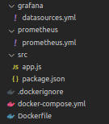

# Preparación
## Aplicación
### Dockerfile

Primero debemos crear un Dockerfile que tendrá:

<table>
<tr>
    <td>
    <br>
        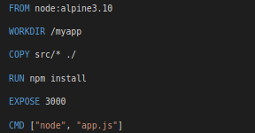
    </td>
    <td>
        - Una imagen de node version alpine3.10 <br> - Situarnos en /myapp <br> - Copiaremos todo lo que haya en src hacia nuestro posicionamiento actual <br> - Instalaremos <br> - Expondremos el puerto 300 - <br> - Ejecutaremos node
    </td>
</tr>
</table>

### Service

Ahora crearemos un docker compose en el que crearemos nuestro primer servicio llamado app de la siguiente manera:

<table>
<tr>
    <td>
    <br><br><br>
        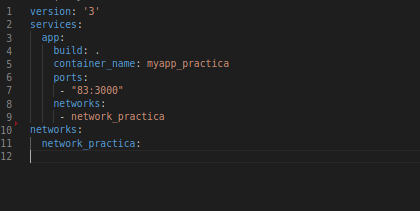
    </td>
    <td>
         - El docker-compose de version 3 <br> - Crear un servicio app <br> - Build . para poder coger el dockerfile acabado de crear <br> - Nombre del contenedor myapp_practica <br> - Expondremos el puerto 83 del 3000 del dockerfile - <br> - Tendra una network llamada network_practica <br> - Damos de alta la network
    </td>
</tr>
</table>

## Prometheus

Deberemos crear un nuevo servicio en nuestro docker-compose de la siguiente manera:


<table>
<tr>
    <td>
    <br>
        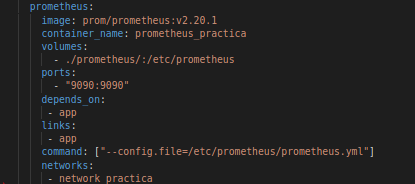
    </td>
    <td>
         - Crear un servicio prometheus <br> - La imagen de prometheus version v2.20.1 <br>- Copiaremos el archivo prometheus.yml al directorio indicado <br>- Nombre del contenedor prometheus_practica <br> - Expondremos el puerto 9090 con el 9090 de prometheus - <br> - depends_on & links para que dependa de app <br> - Ejecutaremos el siguiente comando:  --config.file=/etc/prometheus/prometheus.yml <br> - Estará tambien en la network network_practica
    </td>
</tr>
</table>

## Grafana

Deberemos crear un nuevo servicio en nuestro docker-compose de la siguiente manera:


<table>
<tr>
    <td>
    <br>
        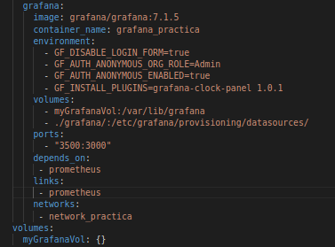
    </td>
    <td>
         - Crear un servicio grafana <br> - La imagen de grafana version 7.1.5 <br>- Nombre del contenedor grafana_practica <br>- Tendremos las siguientes variables para deshabilitar el login, para que ente como admin, que podramos entrar anonimamente y para instalar ese plugin <br>- Dispondra de un volumen llamado myGrafanaVol asociado a esa misma ruta Ademas copiara el archivo grafana.yml al directorio indicado <br>- Expondremos el puerto 3500 con el 3500 de grafana - <br> - depends_on & links para que dependa de prometheus <br>  - Estará tambien en la network network_practica <br> - Daremos de alta el volumen utilizado en este servicio
    </td>
</tr>
</table>

## Docker-compose.yml

Por lo tanto, despues de seguir estos pasos, nuestro docker-compose.yml deberá quedar tal que así:

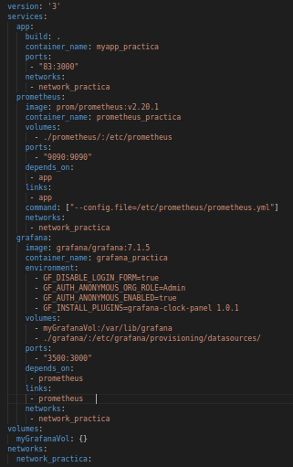

# Running

## Start
Ahora deberemos ejecurar nuestro docker-compose de la siguiente manera.

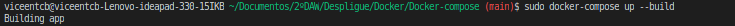

Le añadimos el ``` --build ``` ya que necesita ejecutar al menos un Dockerfile.

## App
Ahora comprobaremos que podemos acceder a todos los endpoints y a metrics.

<table>
<tr>
    <td>
        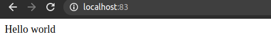
    </td>
    <td>
        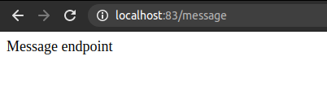
    </td>
</tr>
<tr>
    <td>
        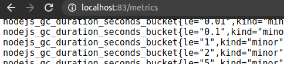
    </td>
    <td>
        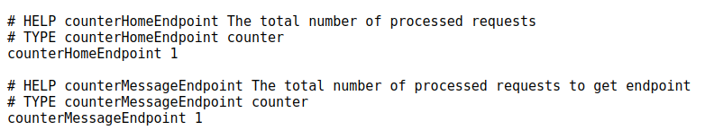
    </td>
</tr>
</table>

## Targets

Posteriormente comprobaremos que se accede correctamente a Prometheus en el puerto 9090 y que en el apartado Status, Targets se muestra el acceso correcto a las métricas capturadas en la app.

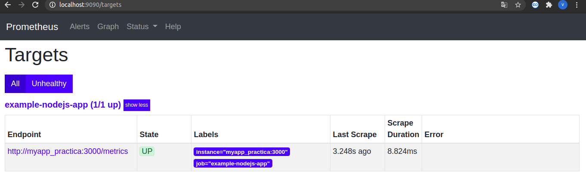

## Graficas

Seguidamente comprobaremos que se accede correctamente a la aplicación de Grafana en el puerto 3500 y se
puede crear un nuevo dashboard para poder incluir paneles en los que mostrar las métricas recogidas en la app

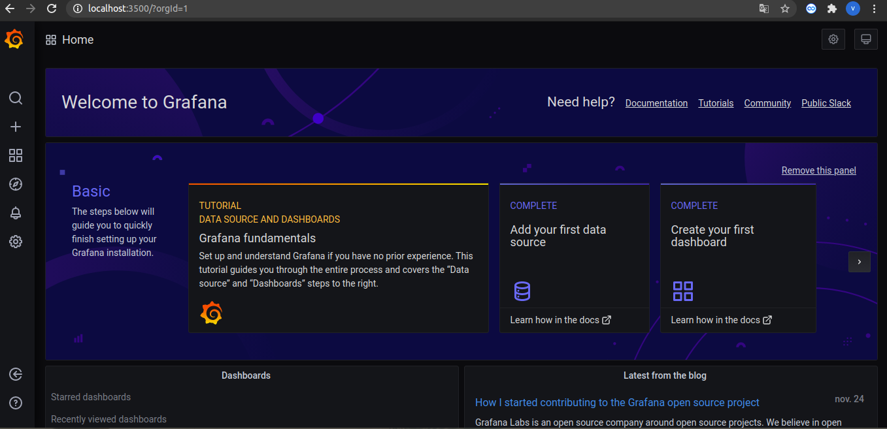

### Dashboards
Ahora haremos click en el ``` +``` Y crearemos un nuevo dashboard.

Primero crearemos uno con las dos peticiones por separado. En el desplegable seleccionaremos Prometheus. Posteriormente crearemos dos querys una con cada endpoint a las cuales les añadirimos una legenda con el nombre del endpoint. En el desplegable de Panel podremos cambiarle el nombre, en este caso a peticiones por Endpoint.

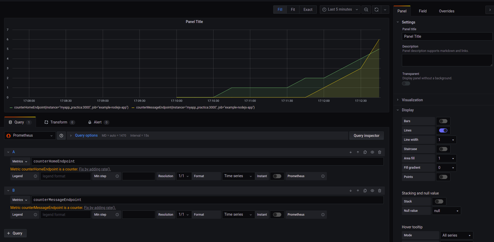

Tras crear el primer dashboard crearemos uno mas, esta vez con las dos peticiones juntas. De nuevo seleccionaremos prometheus en el desplegable, pero ahora en una sola query sumaremos los dos enpoints. Seguidamente en el desplegable de panel cambiaremos la visualización de Graph a Stat. Luego, cambiaremos el nombre del panel a peticiones totales.

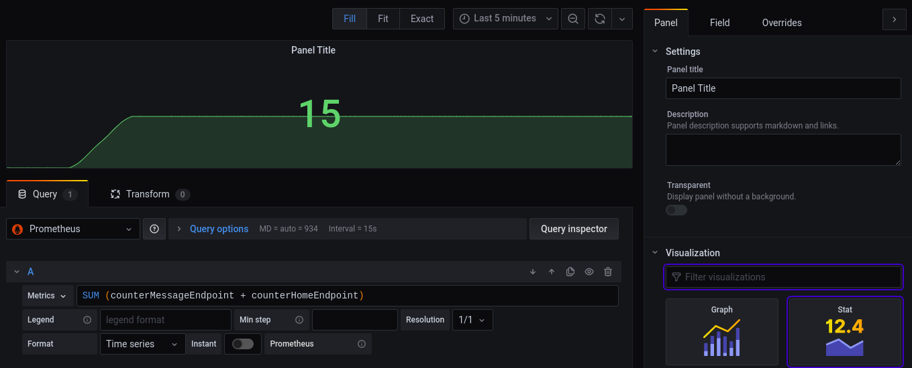

Asi se nos quedará la pagina con los dashboards

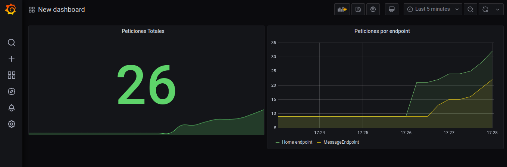


# Integtación proyecto Yolanda

## Estructura

Primero deberemos copiar la carpata grafana y prometheus con sus respectivos archivos yml dentro de la carpeta backend del nuestro nuevo poryecto.


## Archivo docker-compose.yml
En este archivo tendremos lo siguiente:

<table>
<tr>
    <td>
        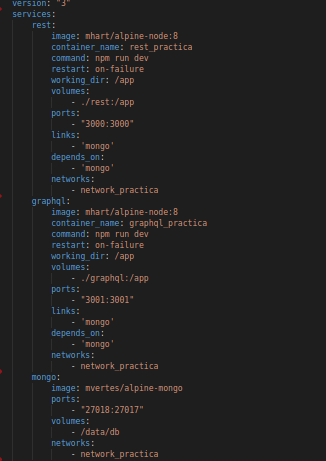 <br>
        
    </td>
    <td>
        - El docker-compose de version 3 <br><br> - Un servicio rest <br> - Una imagen mhart/alphine-node:8 <br> - Nombre del contenedor rest_practica <br>- Commando a ejecutar npm run dev <br> - Restart on-failure  <br> - Creamos un directorio /app <br> - Copiaremos todo el backend rest a este directorio <br>- Expondremos el puerto 3000 con el 3000 de node <br> - depends_on & links para que dependa de mongo<br> - Tendra una network llamada network_practica <br><br> - Un servicio graphql <br> - Una imagen mhart/alphine-node:8 <br> - Nombre del contenedor graphql_practica <br>- Commando a ejecutar npm run dev <br> - Restart on-failure  <br>- Creamos un directorio /app <br> - Copiaremos todo el backend graphql a este directorio<br>- Expondremos el puerto 3001 con el 3001 de este backend <br> - depends_on & links para que dependa de mongo<br> - Tendra una network llamada network_practica <br><br> - Un servicio de mongo <br> - Con una imagen mvertes/alpine-mongo <br>- Expondra el puerto 27018 con el 27017 de mongo" <br> - Un volumen /data/db <br> - Tendra una network llamada network_practica <br><br> - El mismo servicio prometheus de antes <br> - Solo cambiamos depends_on & links para que dependa de rest <br><br>
        - El mismo servicio de Grafana utilizado anteriormente <br><br> - Damos de alta el volumen utilizado por grafana<br>- Damos de alta la network 
    </td>
</tr>
</table>

## JS
Ahora debemos adaptar el codigo de la apliacion anterior a nuestra apliación. Debemos importar las librerias necesarias en el package.json y luego hacer un ```npm instal```. Ahora debemos crear un archivo metrics al mismo nivel que api.

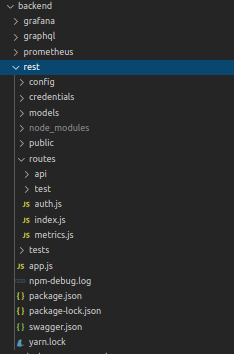

En el cual deberemos poner lo siguiente:

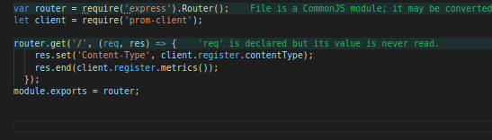

Ahora debemos elegir los endpoint, por ejemplo yo he utilizado los de jewel:

- Primero debemos añadir las variables:

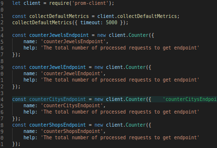

- Y posteriormente llamar al incremento de estas variables:

<table>
<tr>
    <td>
        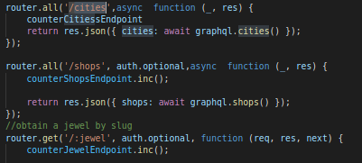
    </td>
    <td>
        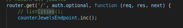
    </td>
</tr>
</table>

## Ejecución

Ahora como no tenemos ningun dockerfile podemos ejecutar directamente con:

 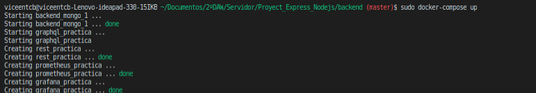

## Comprobaciones

- Primero comprobamos que van los endpoints y metrics (no accederemos a cities para que no reciba ningun endpoint)

<table>
<tr>
    <td>
        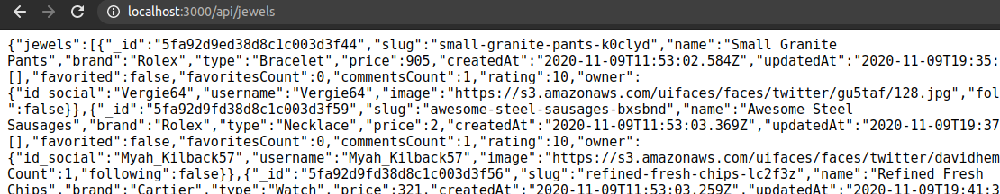
    </td>
    <td>
        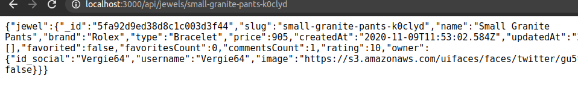
    </td>
    <td>
        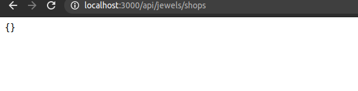
    </td>
</tr>
</table>

- Posteriormente comprobaremos Targets en Prometheus
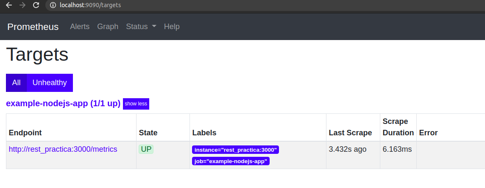

- Posteriormente comprobaremos que entra en grafana
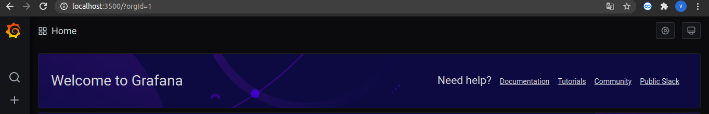

## Graficos

Una vez dentro crearemos los dos graficos, esta vez con estos 4 endpoints.

- Primero el que tenemos uno a uno por separado:

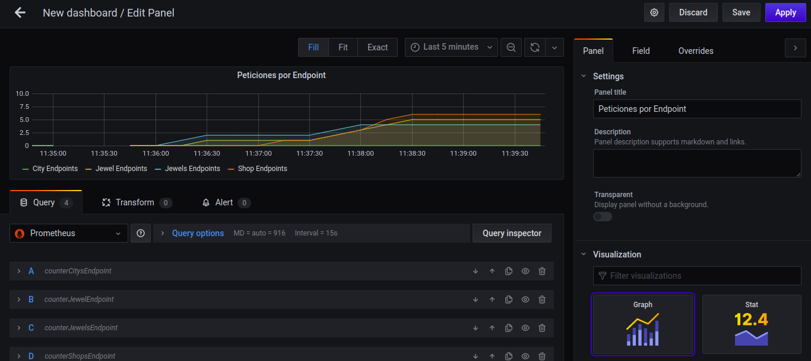

- Luego el une todos los enpoints:

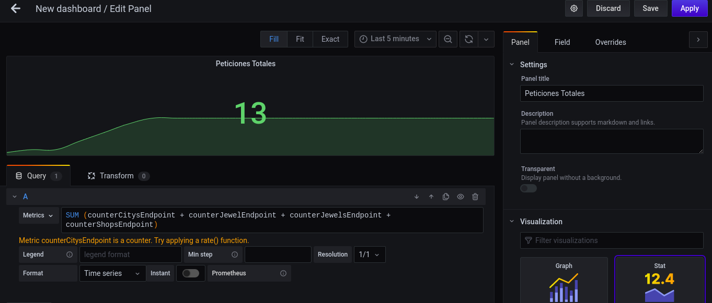

- Una vez mas quedaria asi:

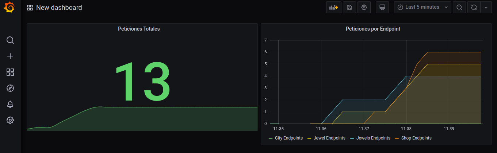
